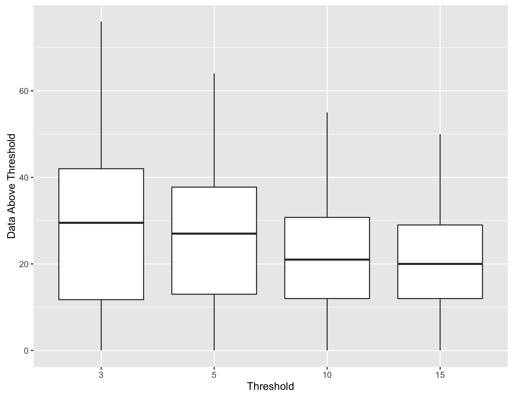
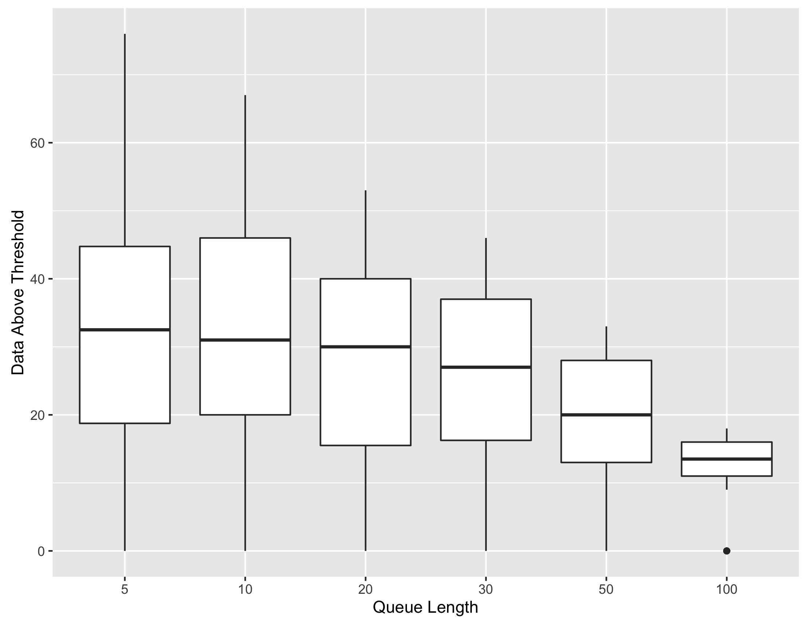
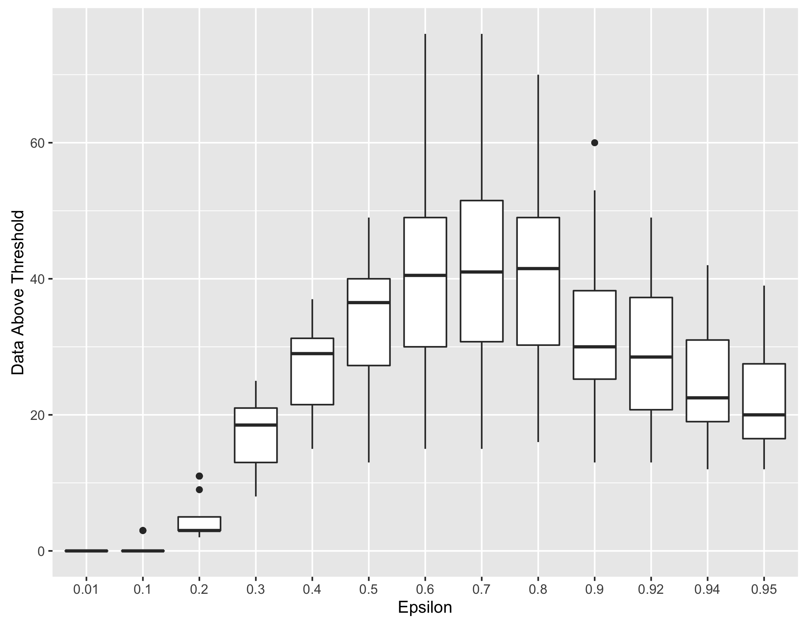

# Getting the correct paramters

I am proposing to do a grid search for the optimal parameters. For this we need a dataset and all the points that are anomolus. With this information, we can come up with a suitable range of values for each of the parameters and run the anomaly detecion code in a nested loop. Something like this:

```
for p1 in parameter1:
    for p2 in parameter2:
        for p3 in parameters3:
            python usageExamples.py <dataset.csv> p1 p2 p3
```


Now we can find the set of parameters that produces anomalies most similar to the actual anomalies known in the given dataset. These parameters can then be used for detecting anomalies in the unlabelled (un-marked) dataset. 

# Example

I have taken S & P 500 dataset containing daily open value for the index from 2007 to 2016 ([sp500_2007_2016.csv](./sp500_2007_2016.csv)). The included code [parameterSearch.py](./parameterSearch.py) runs and produces a [summary file](sp500_2007_2016_mart_summary.csv) with the number of anomulus events detected. The most number of anomalies are detected for the paramters `threshold = 3`, `minQueueLen = 5`, and `epsilon = 0.6`.  For understanding how the number of detecton vary with changes in values for threshold, minQueueLen, and epsilon, I plotted them against the number of detections. 



The above graph shows that as threshold decreases, the number of detected anomalies (data points above threshold) go up. 



The above graph shows that as the queue length decreases, the number of detected anomalies go up.



The above graph shows that highest number of anomalies are detected when epsilon ranges between 0.4 and 0.92 with peaks seen at 0.7.

If R is installed with ggplot2 library, the graphs for each of the parameter combination set are also generated to give a visual idea. `Orange` circles in the graph indicate the detection of anomalies. 


